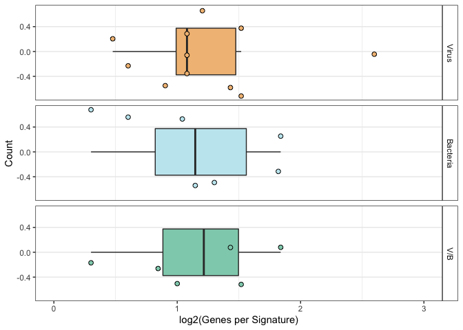

Figure 1B-D
===========

We characterize the size and significant enrichment terms for each
signature

    library(openxlsx)
    library(dplyr)
    library(tidyr)
    library(ggplot2)
    library(enrichR)
    library(ggwordcloud)
    library(Biobase)
    library(org.Hs.eg.db)
    library(patchwork)
    library(stringr)
    library(gridExtra)
    library(grid)

Read signatures as input

    # read signatures
    sigs <- read.xlsx('../tables/supp_1.xlsx') %>%
      mutate(genes = paste0(Positive.Genes,';', Negative.Genes)) %>%
      mutate(Type = gsub(pattern = 'x', replacement = '/', x = Type))

Record signature sizes, plot output

    # split into character vector, remove white space, dashes, and blanks
    sig_list <- lapply(sigs$genes, strsplit, split = ';') %>%
      lapply(function(x){as.character(setdiff(sapply(x, trimws), c('—', '')))})

    # map onto latest symbols
    sig_list <- sig_list %>%
      lapply(mapIds, x = org.Hs.eg.db, keytype = 'SYMBOL', column = 'SYMBOL')
    names(sig_list) <- sigs$Signature.Label

    ## signature sizes
    sizes <- sapply(sig_list, length)
    length(sizes)

    ## [1] 30

    nrow(sigs)

    ## [1] 30

    plot_dat <- sigs %>% 
      mutate('Size' = sizes) %>%
      mutate(Type = factor(Type, levels = c('Virus', 'Bacteria', 'V/B'), ordered = T))

    color_vals <- c('#F2BE84', '#C4E8F0', '#8FD0BA')
    names(color_vals) <- c('Virus', 'Bacteria', 'V/B')

    p4 <- ggplot(plot_dat %>% filter(Type != 'Influenza'), aes(x = log10(Size), fill = Type)) + 
      geom_boxplot(outlier.shape = NA) +
      geom_point(aes(y = 0), pch = 21, size = 2,
                 position = position_jitter(width = 0, height = 0.75)) + 
      labs(x = 'log2(Genes per Signature)', y = 'Count') +
      facet_grid(Type ~ .) +
      scale_fill_manual(values = color_vals) + 
      scale_x_continuous(limits = c(0,3)) + 
      theme_clean + 
      theme(legend.position = 'none') 
    p4

 Enrichment
analysis using EnrichR (output to tables directory)

    # aggregate gene lists of each type for enrichment
    bact_genes <- sig_list[str_detect(pattern = '^B\\d+$', string = names(sig_list))] %>%
      unlist() %>%
      unique()
    vir_genes <- sig_list[str_detect(pattern = '^V\\d+$', string = names(sig_list))] %>%
      unlist() %>%
      unique()
    vxb_genes <- sig_list[str_detect(pattern = '^VxB\\d+$', string = names(sig_list))] %>%
      unlist() %>%
      unique()

    # function to process enrichment results into output data frame
    procEnr <- function(input_list){
      input_list %>%
        bind_rows() %>%
        arrange(Adjusted.P.value) %>%
        return()
    }

    # function to filter processed enrichment results
    ## N_term is the number of genes within a term (pathway)
    ## terms with greater than 200 genes are removed for lack of specificity
    filterEnr <- function(df){
      df <- df %>%
        mutate('N_term' = str_extract(pattern = '/[:digit:]+', string = Overlap)) %>%
        mutate(N_term = gsub(N_term, pattern = '/', replacement = '')) %>%
        mutate(N_term = as.numeric(N_term)) %>%
        filter(N_term <= 200)
      return(df)
    }

    # compute enrichments, format output table, and filter to N_term <= 200 for
    ## virus
    GO_vir <- enrichr(genes = vir_genes, databases = c('GO_Biological_Process_2021')) %>% 
      procEnr() %>% 
      filterEnr()

    ## Uploading data to Enrichr... Done.
    ##   Querying GO_Biological_Process_2021... Done.
    ## Parsing results... Done.

    ## bacteria
    GO_bac <- enrichr(genes = bact_genes, databases = c('GO_Biological_Process_2021')) %>% 
      procEnr() %>% 
      filterEnr()

    ## Uploading data to Enrichr... Done.
    ##   Querying GO_Biological_Process_2021... Done.
    ## Parsing results... Done.

    ## v/b
    GO_vxb <- enrichr(genes = vxb_genes, databases = c('GO_Biological_Process_2021')) %>% 
      procEnr() %>% 
      filterEnr()

    ## Uploading data to Enrichr... Done.
    ##   Querying GO_Biological_Process_2021... Done.
    ## Parsing results... Done.

    # print formatted results to output table
    output_xlsx <- list('GO vir' = GO_vir,
                        'GO_bac' = GO_bac,
                        'GO_vxb' = GO_vxb
                        )
    write.xlsx(output_xlsx, "../tables/aggregated_enrichment_terms.xlsx", overwrite = T)
