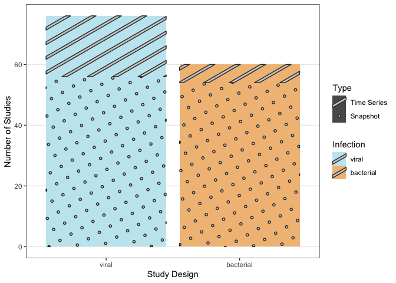
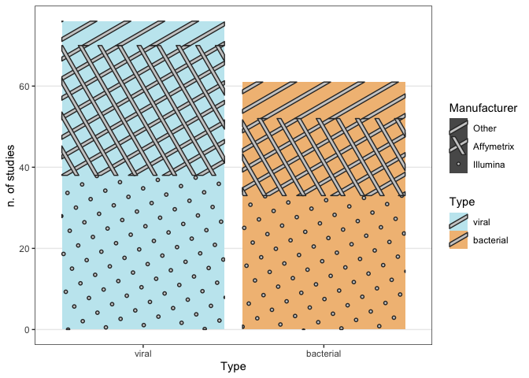

Figure 2C-E
===========

Here, we characterize technical factors in viral and bacterial datasets
that may bias downstream evaluation.

Note: final visual styling for the manuscript was done in
post-processing

Figure 2C: study sizes (number of samples)

Figure 2D: time series vs. cross-sectional study designs

Figure 2E: platform manufacturers

Figure 2C: Study sizes for viral vs. bacterial datasets
-------------------------------------------------------

    # function that takes in a MetaIntegrator object MIobj, 
    # positive and negative class information, and a minimum sample size (default 4)
    # and returns an index indicating whether the dataset should be included (T) or
    # excluded (F)
    findStudyWithClass <- function(MIobj, pos_class, neg_class, N_threshold = 4){
      # logical indices for samples in the positive and negative classes
      pos_ix <- sum(MIobj$pheno$Class %in% pos_class)
      neg_ix <- sum(MIobj$pheno$Class %in% neg_class)
      
      # T if both positive and negative classes are above the minimum sample size 
      if(sum(pos_ix) >= N_threshold & sum(neg_ix) >= N_threshold){
        return(T)
      } else {
        return(F)
      }
    }

    # find bacterial studies
    bac_ix <- sapply(data_list, 
                     findStudyWithClass, 
                     pos_class = 'Bacteria', 
                     neg_class = c('Healthy', 'Other.Infectious', 'Other.NonInfectious', 'Convalescent'))

    ## print bacterial class vectors to sanity check that correct studies were identified
    # sapply(data_list[bac_ix], function(x){table(x$pheno$Class)})

    # find viral studies
    vir_ix <- sapply(data_list, 
                     findStudyWithClass, 
                     pos_class = 'Virus', 
                     neg_class = c('Healthy', 'Other.Infectious', 'Other.NonInfectious', 'Convalescent'))

    ## print viral class vectors to sanity check that correct studies were identified
    #sapply(data_list[vir_ix], function(x){table(x$pheno$Class)})

    # function that takes a MetaIntegrator object (MIobj) input and a list of 
    # desired classes within $pheno and returns a sample size
    getNClass <- function(MIobj, input_classes){
      return(sum(MIobj$pheno$Class %in% input_classes))
    }

    # bacterial and viral sample sizes
    bac_N <- sapply(data_list[bac_ix], getNClass, input_classes = c('Bacteria', 'Healthy', 'Other.Infectious', 'Other.NonInfectious'))
    vir_N <- sapply(data_list[vir_ix], getNClass, input_classes = c('Virus', 'Healthy', 'Other.Infectious', 'Other.NonInfectious'))

    # format for plotting
    hist_plot_dat <- data.frame(
      'Type' = c(rep('Virus', length(vir_N)),
                 rep('Bacteria', length(bac_N))),
      'N' = c(vir_N, bac_N))
    hist_plot_dat <- hist_plot_dat %>% 
      mutate(Type = factor(Type, levels = c('Virus', 'Bacteria'), labels = c('viral', 'bacterial'), ordered = T))

    # plots of sample sizes
    ## histogram
    #ggplot(hist_plot_dat, aes(x = N, fill = Type)) + geom_histogram()
    ## boxplots
    color_vals <- c('#C4E8F0', '#F2BE84')
    names(color_vals) <- c('viral', 'bacterial')

    p2c <- ggplot(hist_plot_dat, aes(x = Type, y = N, fill = Type)) + 
      geom_boxplot() + 
      scale_fill_manual(values = color_vals) + 
      stat_compare_means(method = 'wilcox.test') + 
      theme_clean
    p2c

Time-series vs. cross-sectional study designs for viral vs. bacterial datasets
------------------------------------------------------------------------------

    # function
    ## input: MetaIntegrator object (MIobj)
    ## output: logical indicating time series (T) or cross-sectional (F)
    findTS <- function(MIobj){
      # MIobjs with $pheno containing $Time.Point were annotated as time series
      if(sum(names(MIobj$pheno) == 'Time.Point') > 0){
        return(T)
      } else{
        return(F)
      }
    }

    # ID time-series datasets
    time_series_ix <- sapply(data_list, findTS)
    ts_list <- data_list[time_series_ix]

    # count time-series viral and bacterial datasets
    ts_bac_ix <- sapply(ts_list, findStudyWithClass, pos_class = 'Bacteria', neg_class = c('Healthy', 'Other.NonInfectious', 'Convalescent'))
    ts_vir_ix <- sapply(ts_list, findStudyWithClass, pos_class = 'Virus', neg_class = c('Healthy', 'Other.NonInfectious', 'Convalescent'))
    ts_non_ix <- sapply(ts_list, findStudyWithClass, pos_class = 'Other.Infectious', neg_class = c('Healthy', 'Other.NonInfectious', 'Convalescent'))

    ## Counting and sanity checks
    #sum(ts_bac_ix)
    #sum(ts_vir_ix)
    #sum(ts_non_ix)

    #sapply(ts_list[ts_non_ix], function(x){table(x$pheno$Pathogen)})
    ## GSE28405_GPL2700 is viral
    ## GSE68310_GPL10558 is viral
    ## GSE7000_GPL4857 is bacterial and other.infectious
    ## GSE35859_GPL15241 is other.infectious
    #sapply(ts_list[ts_vir_ix], function(x){table(x$pheno$Pathogen)})
    ## these are all correct
    # sapply(ts_list[ts_bac_ix], function(x){table(x$pheno$Pathogen)})

    # get time-series counts per pathogen type
    N_other <- 2 # 7000 is common with bacteria (manually checked)
    N_vir <- sum(ts_vir_ix) # all look correct
    N_bac <- sum(ts_bac_ix) # 2 are in common with the virus list (40012 and 20346)

    # get cross-sectional counts per pathogen type
    vir_accs <- names(data_list[vir_ix]) # snapshot studies are the unused from each category
    bac_accs <- names(data_list[bac_ix])
    if(mean(names(ts_list[ts_vir_ix]) %in% vir_accs) != 1){
      stop('not all viral ts in full ts list')
    }
    N_vir_snapshot <- sum(!vir_accs %in% names(ts_list[ts_vir_ix]))
    N_bac_snapshot <- sum(!bac_accs %in% names(ts_list[ts_bac_ix]))

    # format plot data
    ts_N_df <- data.frame(Infection = c('Virus', 'Virus', 'Bacteria', 'Bacteria'), 
                          Type = c('Time Series', 'Snapshot', 'Time Series', 'Snapshot'),
                          N = c(N_vir, N_vir_snapshot, N_bac, N_bac_snapshot)) %>% 
      mutate(Infection = factor(Infection, levels = c('Virus', 'Bacteria'), labels = c('viral', 'bacterial'), ordered = T))%>%
      mutate(Type = factor(Type, levels = c('Time Series', 'Snapshot'), ordered = T))

    # plot
    color_vals <- c('#C4E8F0', '#F2BE84')
    names(color_vals) <- c('viral', 'bacterial')

    # plot
    p2d <- ts_N_df %>%
      ggplot(aes(x = Infection, y = N, fill = Infection, pattern = Type)) + 
      geom_bar_pattern(stat = 'identity') + 
      theme_clean + 
      scale_fill_manual(values = color_vals) + 
      labs(x = 'Study Design', y = 'Number of Studies')
    p2d

Platform manufacturer for viral and bacterial datasets
------------------------------------------------------

    # function
    ## input: dataset name
    ## output: GEO platform accession as GPL####
    parsePlatform <- function(str){
      str_extract(pattern = 'GPL\\d+', string = str) %>%
        return()
    }

    # function
    ## input: list of MetaIntegrator objects (input_list), pathogen type str (type)
    ## output: data frame, sorted count of platforms with pathogen type labeled
    getPlatformsFromList <- function(input_list, type){
      input_list %>%
        names() %>%
        parsePlatform() %>%
        table() %>%
        sort(decreasing = T) %>%
        as.data.frame() %>%
        mutate('Type' = type) %>%
        return()
    }

    # get viral and bacterial platform counts
    vir_platforms <- getPlatformsFromList(data_list[vir_ix], 'Virus')
    bac_platforms <- getPlatformsFromList(data_list[bac_ix], 'Bacteria')

    # format for plotting
    platform_df <- bind_rows(vir_platforms, bac_platforms)
    names(platform_df)[1] <- 'Platform'

    # manually encode main platforms found in data that are not listed in the master table
    appending_platforms <- 
    data.frame('Platform' = c('GPL6254',   'GPL14604', 'GPL15615', 'GPL17586', 'GPL17692', 'GPL21947', 'GPL23126', 'GPL8300', 'GPL9392', 'GPL13287', 'GPL16951', 'GPL20844', 'GPL6254'),
           'Manufacturer' = c('other',     'affy',     'other',    'affy',     'affy',     'other',    'affy',     'affy',    'affy',    'other',    'other',    'other',    'other'))

    # load main platform annotation table linking GPL IDs to manufacturers
    annotation_df <- openxlsx::read.xlsx(paste0(Sys.getenv('DARPA'), 'Input/platform_specific/platform_types.xlsx')) %>%
      filter(!is.na(Manufacturer)) %>% 
      bind_rows(appending_platforms)

    # add manufacturers to list of data platforms
    platform_df <- platform_df %>%
      left_join(annotation_df)

    ## Joining, by = "Platform"

    # filter down to Illumina and Affymetrix, label everything else "other"
    manufacturer_df <- platform_df %>%
      mutate(Manufacturer = ifelse(!Manufacturer %in% c('ilmn', 'affy'), 'other', Manufacturer)) %>% 
      group_by(Manufacturer, Type) %>%
      summarize('Freq' = sum(Freq)) %>%
      mutate(Manufacturer = factor(Manufacturer, 
                                   levels = rev(c('ilmn', 'affy', 'other')), 
                                   labels = rev(c('Illumina', 'Affymetrix', 'Other')), 
                                   ordered = T)) %>%
      mutate(Type = factor(Type, levels = c('Virus', 'Bacteria'), labels = c('viral', 'bacterial'), ordered = T))

    ## `summarise()` has grouped output by 'Manufacturer'. You can override using the `.groups` argument.

    # plot
    color_vals <- c('#C4E8F0', '#F2BE84')
    names(color_vals) <- c('viral', 'bacterial')

    p2e <- ggplot(manufacturer_df, aes(x = Type, y = Freq, fill = Type)) + 
      geom_bar_pattern(aes(pattern = Manufacturer), stat = 'identity') + 
      #geom_bar(stat = 'identity') + 
      theme_clean + 
      scale_fill_manual(values = color_vals) +
      #theme(axis.text.x = element_text(angle = 90, hjust = 1, vjust = 0.5)) + 
      labs(y = 'n. of studies')
    p2e

