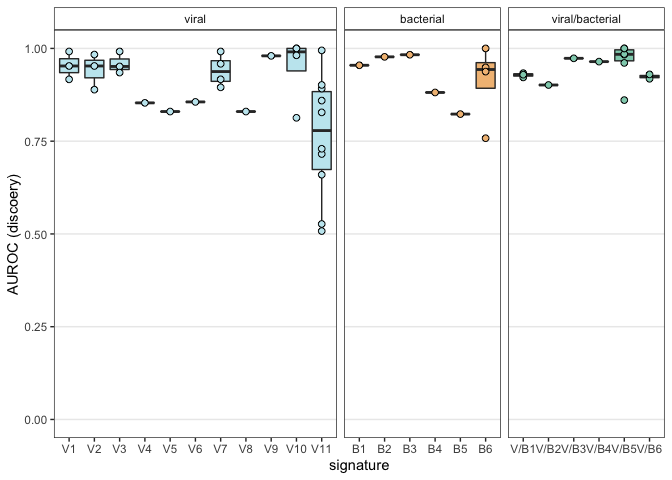

\#Figure 3: a framework for benchmarking transcriptional signatures
\#\#The goal of this analysis is to demonstrate that our framework
recapitulates the discovery performance of each signature.

Robustness is evaluated using
`analysis/calc_robustness_crossreactivity.R`

Performance measurements are filtered to discovery datasets and plotted

    # apply signature ordering for plotting
    sig_order <- lapply(c('VxB', 'V', 'B'), function(x){
      paste0(x, 1:15)}) %>%
      unlist()

    # format AUROC list for plotting
    gen_df <- readRDS(input_file) %>%
      bind_rows() %>%
      #filter(Type == 'Discovery') %>%
      filter(!grepl(pattern = 'I', x = Signature)) %>% # remove influenza signatures
      mutate(Comparison = str_extract(string = Signature, pattern = 'VxB|V|B')) %>% # order for plotting
      mutate(Comparison = factor(Comparison, levels = c('VxB', 'V', 'B'), labels = c('VxB', 'Virus', 'Bacteria'), ordered = T)) %>%
      mutate(Signature = factor(x = Signature, levels = sig_order, ordered = T))

    contrast <- str_extract(pattern = 'healthy|noninf|orig', string = input_file)

    # filter to N >= 4
    gen_df <- gen_df %>%
      filter(N > 4) %>%
      mutate(Signature = str_replace(pattern = 'VxB', replacement = 'V/B', string = Signature)) %>% 
      mutate(Comparison = str_replace(pattern = 'VxB', replacement = 'V/B', string = Comparison)) 

    disc_df <- gen_df %>%
      filter(Type == 'Discovery') %>% 
      mutate(Comparison = str_extract(string = Signature, pattern = 'V/B|^V|^B')) %>%
      mutate(Comparison = factor(Comparison, levels = c('V', 'B', 'V/B'), ordered = T))

    color_vals <- c('#F2BE84', '#C4E8F0', '#8FD0BA', 'gray50', '#F2BE84', '#C4E8F0', '#8FD0BA')
    names(color_vals) <- c('B', 'V', 'V/B', 'not robust', 'bacterial', 'viral', 'viral/bacterial')

    pout <- ggplot(disc_df %>% 
                     filter(N > 4) %>%
                     mutate(Signature = factor(Signature, levels = gsub(sig_order, pattern = 'x', replacement = '/'), ordered = T)) %>%
                     mutate(Comparison = gsub(pattern = 'V', replacement = 'viral', x = Comparison)) %>% 
                     mutate(Comparison = gsub(pattern = 'B', replacement = 'bacterial', x = Comparison)) %>%
                     mutate(Comparison = factor(Comparison, levels = c('viral', 'bacterial', 'viral/bacterial'), ordered = T)), 
           aes(x = Signature, y = Scores, fill = Comparison)) +
      
      geom_boxplot(outlier.shape = NA) + 
      geom_point(pch = 21, size = 2) + 
      
      #geom_vline(xintercept = AUC_threshold, color = 'red', linetype = 'dashed') + 
      #geom_vline(xintercept = 0.5, color = 'black', linetype = 'dashed') + 
      
      facet_grid(. ~ Comparison, space = 'free', scales = 'free') +
      scale_fill_manual(values = color_vals) +
      ylim(c(0,1)) + 
      labs(y = 'AUROC (discoery)', x = 'signature') +
      theme_clean +
      theme(legend.position = 'none', strip.background = element_rect(fill = 'white'))
    pout

