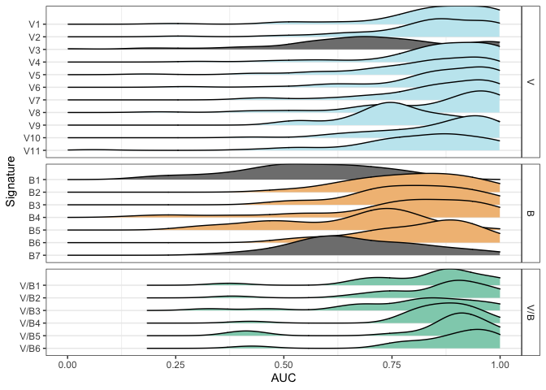
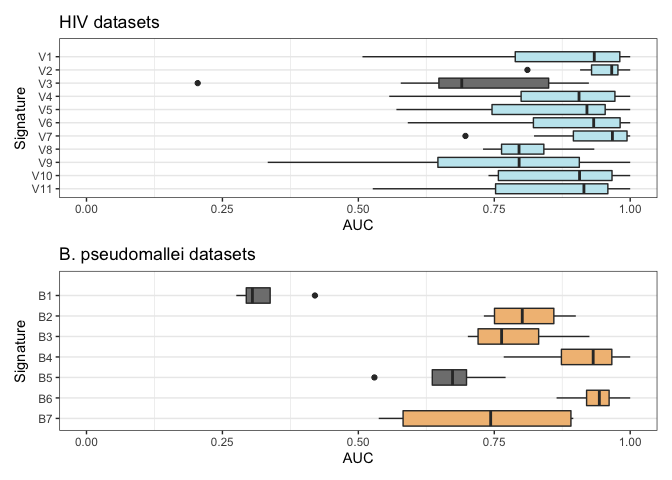
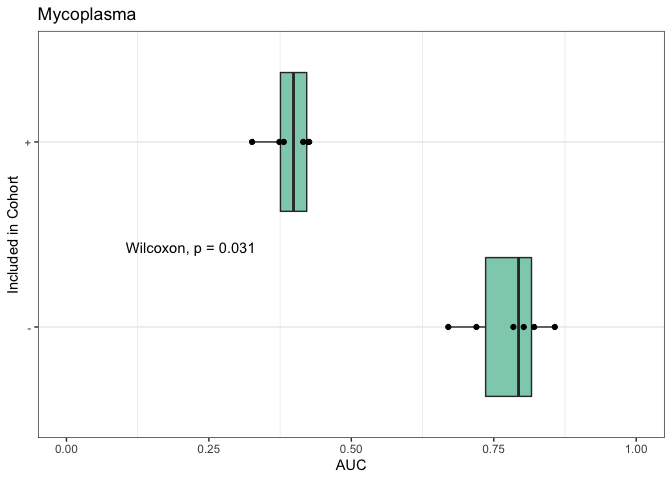
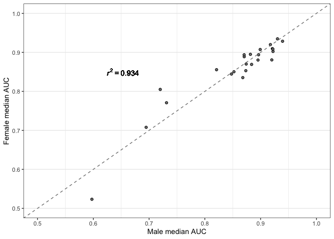
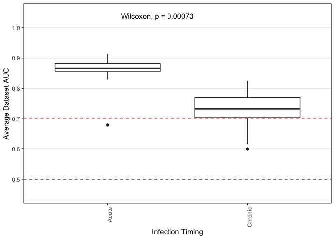
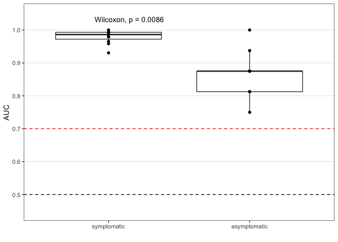

\#Figure 4: Existing signatures of bacterial and viral infection are
generally robust when evaluated in independent data

Robustness is evaluated using
`analysis/calc_robustness_crossreactivity.R`

Initialization:

    library(dplyr)

    ## 
    ## Attaching package: 'dplyr'

    ## The following objects are masked from 'package:stats':
    ## 
    ##     filter, lag

    ## The following objects are masked from 'package:base':
    ## 
    ##     intersect, setdiff, setequal, union

    library(ggplot2)
    library(stringr)
    library(openxlsx)
    library(ggridges)

    source('../analysis/plot_palette.R')

Plotting:

4A-C: Robustness of V, B, and V/B signatures
--------------------------------------------

    gen_df <- readRDS(input_file) %>%
      bind_rows() %>%
      filter(!grepl(pattern = 'I', x = Signature)) %>% 
      mutate(Comparison = str_extract(string = Signature, pattern = 'VxB|V|B')) %>%
      mutate(Comparison = factor(Comparison, levels = c('VxB', 'V', 'B'), labels = c('VxB', 'Virus', 'Bacteria'), ordered = T)) %>%
      mutate(Signature = factor(x = Signature, levels = sig_order, ordered = T))

    contrast <- str_extract(pattern = 'healthy|noninf|orig', string = input_file)

    # update discovery/validation annotations
    modified_disc <- read.xlsx('../tables/supp_1.xlsx') %>%
      filter(grepl(pattern = 'GSE73072', x = Discovery.Accessions))

    # update discovery/validation labels
    for (sig in 1:nrow(modified_disc)){
      signature_row <- modified_disc[sig, ]
      sdys <- str_split(signature_row$Discovery.Accessions, pattern = ';') %>% unlist()
      gen_df <- gen_df %>%
        mutate(Type = ifelse((Signature == signature_row$Signature.Label & Study %in% sdys), 'Discovery', Type))
    }

    gen_df <- gen_df %>%
      filter(N > 4) %>%
      mutate(Signature = str_replace(pattern = 'VxB', replacement = 'V/B', string = Signature)) %>% 
      mutate(Comparison = str_replace(pattern = 'VxB', replacement = 'V/B', string = Comparison)) 

    # filter to non-discovery
    nondisc_df <- gen_df %>%
      filter(Type %in% c('Validation', 'New'))

    # format for plotting
    color_vals <- c('#F2BE84', '#C4E8F0', '#8FD0BA', 'gray50')
    names(color_vals) <- c('B', 'V', 'V/B', 'not robust')
    sig_order <- c(
      paste0('V', 1:11), paste0('B', 1:7), paste0('V/B', 1:7)
    ) %>% rev()

    # color distributions according to threshold
    AUC_threshold <- 0.7
    color_dat <- nondisc_df %>%
        group_by(Signature) %>%
        summarize('med' = median(Scores)) %>% # find the fraction of values below this point
        arrange(med) %>%
        mutate('Specificity' = factor(ifelse(med <= AUC_threshold, 'not robust', 'robust'))) %>% # label signatures with more than 25% of their values above the threshold red
        dplyr::select(-med)

    # format data for plotting
    plot_dat <- nondisc_df %>% 
      left_join(color_dat) %>% 
      mutate(Comparison = ifelse(Comparison == 'Bacteria', 'B', Comparison)) %>% 
      mutate(Comparison = ifelse(Comparison == 'Virus', 'V', Comparison)) %>%
      mutate(Comparison = factor(Comparison, levels = c("V", "B", "V/B"), ordered = T)) %>%
      mutate(Signature = factor(Signature, levels = sig_order, ordered = T)) %>%
      mutate(Specificity = ifelse(Specificity == 'robust', as.character(Comparison), 'not robust'))

    ## Joining, by = "Signature"

    op1 <- ggplot(plot_dat, aes(x = Scores, y = Signature, fill = Specificity)) +
      #geom_vline(xintercept = AUC_threshold, color = 'red', linetype = 'dashed') + 
      #geom_vline(xintercept = 0.5, color = 'black', linetype = 'dashed') + 
      #geom_density_ridges(stat = 'binline', binwidth = 0.05) +
      geom_density_ridges() +
      facet_grid(Comparison ~ ., space = 'free', scales = 'free') +
      scale_fill_manual(values = color_vals) +
      xlim(c(0,1)) + 
      labs(x = 'AUC') +
      theme_clean +
      theme(legend.position = 'none')

    op1

    ## Picking joint bandwidth of 0.0516

    ## Picking joint bandwidth of 0.0608

    ## Picking joint bandwidth of 0.0474

4D-E Robustness for HIV and B. Pseudomallei infection
-----------------------------------------------------

HIV and B. pseudomallei performance was evaluated separately using
`analysis/calc_robustness_crossreactivity.R` and datasets from the
compendium containing these pathogens with healthy controls

    ##    Min. 1st Qu.  Median    Mean 3rd Qu.    Max. 
    ##  0.7955  0.9061  0.9177  0.9039  0.9336  0.9673

    ## # A tibble: 6 × 2
    ##   Signature   med
    ##   <ord>     <dbl>
    ## 1 B7        0.743
    ## 2 B6        0.943
    ## 3 B5        0.673
    ## 4 B4        0.932
    ## 5 B3        0.763
    ## 6 B2        0.802

4F Mycoplasma performance
-------------------------

    library(ggpubr)
    library(tidyr)

    ## 
    ## Attaching package: 'tidyr'

    ## The following object is masked from 'package:reshape2':
    ## 
    ##     smiths

    source('../analysis/helperFunctions.R')

    ## Loading required package: AnnotationDbi

    ## Warning: package 'AnnotationDbi' was built under R version 4.0.3

    ## Loading required package: stats4

    ## Loading required package: BiocGenerics

    ## Warning: package 'BiocGenerics' was built under R version 4.0.5

    ## Loading required package: parallel

    ## 
    ## Attaching package: 'BiocGenerics'

    ## The following objects are masked from 'package:parallel':
    ## 
    ##     clusterApply, clusterApplyLB, clusterCall, clusterEvalQ,
    ##     clusterExport, clusterMap, parApply, parCapply, parLapply,
    ##     parLapplyLB, parRapply, parSapply, parSapplyLB

    ## The following objects are masked from 'package:dplyr':
    ## 
    ##     combine, intersect, setdiff, union

    ## The following objects are masked from 'package:stats':
    ## 
    ##     IQR, mad, sd, var, xtabs

    ## The following objects are masked from 'package:base':
    ## 
    ##     anyDuplicated, append, as.data.frame, basename, cbind, colnames,
    ##     dirname, do.call, duplicated, eval, evalq, Filter, Find, get, grep,
    ##     grepl, intersect, is.unsorted, lapply, Map, mapply, match, mget,
    ##     order, paste, pmax, pmax.int, pmin, pmin.int, Position, rank,
    ##     rbind, Reduce, rownames, sapply, setdiff, sort, table, tapply,
    ##     union, unique, unsplit, which.max, which.min

    ## Loading required package: Biobase

    ## Warning: package 'Biobase' was built under R version 4.0.3

    ## Welcome to Bioconductor
    ## 
    ##     Vignettes contain introductory material; view with
    ##     'browseVignettes()'. To cite Bioconductor, see
    ##     'citation("Biobase")', and for packages 'citation("pkgname")'.

    ## Loading required package: IRanges

    ## Warning: package 'IRanges' was built under R version 4.0.3

    ## Loading required package: S4Vectors

    ## Warning: package 'S4Vectors' was built under R version 4.0.3

    ## 
    ## Attaching package: 'S4Vectors'

    ## The following object is masked from 'package:tidyr':
    ## 
    ##     expand

    ## The following objects are masked from 'package:dplyr':
    ## 
    ##     first, rename

    ## The following object is masked from 'package:base':
    ## 
    ##     expand.grid

    ## 
    ## Attaching package: 'IRanges'

    ## The following objects are masked from 'package:dplyr':
    ## 
    ##     collapse, desc, slice

    ## 
    ## Attaching package: 'AnnotationDbi'

    ## The following object is masked from 'package:dplyr':
    ## 
    ##     select

    ## 

    ## Warning: package 'limma' was built under R version 4.0.3

    ## 
    ## Attaching package: 'limma'

    ## The following object is masked from 'package:BiocGenerics':
    ## 
    ##     plotMA

    ## Loading required package: lattice

    ## Loading required package: foreach

    ## Loading required package: iterators

    source('../analysis/plot_palette.R')

    signatures_file <- '../tables/supp_1.xlsx'
    signatures <- read.xlsx(signatures_file)

    # helper function to parse dataset into just gram pos / just gram neg
    repairIndex <- function(index){
      ix <- is.na(index)
      index[ix] <- F
      return(index)
    }

    # make 3 versions of GSE103119 depending on gram stain
    data_list <- list()
    index_pos <- repairIndex((p$Gram == 'Positive' & p$Class %in% c('Bacteria')) | p$Class %in% c('Virus'))
    index_neg <- repairIndex((p$Gram == 'Negative' & p$Class %in% c('Bacteria')) | p$Class %in% c('Virus'))
    index_both <- repairIndex((p$Gram %in% c('Positive', 'Negative') & p$Class == 'Bacteria') | p$Class %in% c('Virus'))

    # make metaIntegrator objects for each index
    MIobj_positive <- filterMIobj(MIobj, index_pos)
    MIobj_negative <- filterMIobj(MIobj, index_neg)
    MIobj_both <- filterMIobj(MIobj, index_both)

    # barplot of subjects for positive and negative gram stains
    signatures <- signatures %>%
      filter(Type == 'VxB')
    nrow(signatures)

    ## [1] 6

    # parse Signatures for scoring
    filterObjs <- list()
    for(i in 1:nrow(signatures)){
      filterObjs[[i]] <- sig2Meta(signatures[i,])
    }

    ## 'select()' returned 1:1 mapping between keys and columns

    ## 'select()' returned 1:1 mapping between keys and columns
    ## 'select()' returned 1:1 mapping between keys and columns
    ## 'select()' returned 1:1 mapping between keys and columns
    ## 'select()' returned 1:1 mapping between keys and columns
    ## 'select()' returned 1:1 mapping between keys and columns
    ## 'select()' returned 1:1 mapping between keys and columns
    ## 'select()' returned 1:1 mapping between keys and columns
    ## 'select()' returned 1:1 mapping between keys and columns
    ## 'select()' returned 1:1 mapping between keys and columns

    # score datasets and format for plotting
    score_df <- sapply(filterObjs, FUN = calculateScore, datasetObject = MIobj_both) %>%
      cbind()

    ## Used  24 of  24  pos genes, and  0  of  0  neg genes 
    ## Used  9 of  9  pos genes, and  0  of  0  neg genes 
    ## Used  29 of  29  pos genes, and  37  of  37  neg genes 
    ## Used  19 of  19  pos genes, and  14  of  14  neg genes 
    ## Used  3 of  3  pos genes, and  4  of  4  neg genes 
    ## Used  1 of  1  pos genes, and  1  of  1  neg genes

    signature_names <- sapply(filterObjs, function(x){return(x$filterDescription)}) 
    colnames(score_df) <- signature_names
    score_df <- score_df %>%
      as.data.frame()

    # plot
    plot_dat <- MIobj_both$pheno %>%
      dplyr::select(geo_accession, Pathogen, Class, Gram) %>%
      bind_cols(score_df) %>%
      reshape2::melt(id.vars = c('geo_accession', 'Pathogen', 'Class', 'Gram'), value.name = 'Score', variable.name = 'Signature') %>%
      mutate(Gram = ifelse(is.na(Gram), '', Gram)) %>%
      mutate(Infection = ifelse(Class == 'Virus', 'Virus', NA)) %>%
      mutate(Infection = ifelse(Gram == 'Positive', 'Gram positive bacteria', Infection)) %>%
      mutate(Infection = ifelse(Gram == 'Negative', 'Mycoplasma', Infection)) %>%
      mutate(Infection = factor(Infection, levels = c('Gram positive bacteria', 'Virus', 'Mycoplasma'), ordered = T))

    signature_labels <- unique(plot_dat$Signature)

    plot_dat2 <- plot_dat %>%
      mutate('Signature' = factor(Signature, level = signature_labels, ordered = T)) %>%
      mutate('xl' = factor(Infection, levels = c('Gram positive bacteria',
                                                   'Mycoplasma', 
                                                   'Virus'), 
                             labels = c('+', '-', 'vir'), 
                             ordered = T)) %>%
      group_by(Signature) %>%
      summarize('+' = auroc(bool = (xl == 'vir'), score = Score), '-' = auroc(bool = (xl == 'vir')[xl != '-'], score = Score[xl != '-'])) %>%
      pivot_longer(names_to = 'Type', values_to = 'AUC', cols = !Signature)

    p4f <- ggplot(plot_dat2 %>% mutate(Comparison = 'V/B'), aes(x = Type, y = AUC, fill = Comparison)) + 
      geom_boxplot() + 
      geom_point() + 
      #geom_vline(xintercept = 0.5, linetype = 'dashed', color = 'black') + 
      scale_fill_manual(values = color_vals) +
      stat_compare_means(paired = T, method = 'wilcox.test', position = position_nudge(y = -0.85, x = 0.4)) + 
      ylim(c(0,1)) + 
      coord_flip() + 
      labs(title = 'Mycoplasma', x = 'Included in Cohort') + 
      theme(axis.text.y = element_text(size = 20)) + 
      theme_clean + 
      theme(legend.position = 'none')
    p4f

4G: Male vs female performance
------------------------------

Data lists were created for infectious conditions using
`analysis/imputing_sex.R` Performance in males and females was evaluated
for each signature using `analysis_calc_robustness_crossreactivity.R`

    male_df <- bind_rows(male) %>%
      #mutate('Imputed.Sex' = 'male') %>%
      dplyr::select(Study, Signature, Type, Scores, N) %>%
      dplyr::rename('Male.Scores' = Scores, 'Male.N' = N)
    female_df <- bind_rows(female) %>%
      #mutate('Imputed.Sex' = 'female') %>%
      dplyr::select(Study, Signature, Type, Scores, N) %>%
      dplyr::rename('Female.Scores' = Scores, 'Female.N' = N)

    sig_order <- c(paste0('VxB', 1:7), paste0('V', 1:12), paste0('B', 1:9))
    plot_df <- male_df %>%
      left_join(female_df) %>%
      mutate('Comparison' = str_extract(pattern = 'VxB|V|B', string = Signature)) %>%
      mutate(Signature = factor(Signature, levels = sig_order, ordered = T)) 

    ## Joining, by = c("Study", "Signature", "Type")

    mini_df <- plot_df %>%
      group_by(Comparison, Signature) %>%
      summarize('Male.AUC' = median(Male.Scores, na.rm = T), 'Female.AUC' = median(Female.Scores, na.rm = T)) %>%
      ungroup() %>%
      mutate(Comparison = gsub(pattern = 'VxB', replacement = 'V/B', x = Comparison))

    ## `summarise()` has grouped output by 'Comparison'. You can override using the `.groups` argument.

    lm_eqn <- function(df){
      m <- lm(Female.AUC ~ Male.AUC, df);
      # eq <- substitute(italic(y) == a + b %.% italic(x)*","~~italic(r)^2~"="~r2, 
      #                  list(a = format(unname(coef(m)[1]), digits = 2),
      #                       b = format(unname(coef(m)[2]), digits = 2),
      #                       r2 = format(summary(m)$r.squared, digits = 3)))
      eq <- substitute(~~italic(r)^2~"="~r2, 
                       list(r2 = format(summary(m)$r.squared, digits = 3)))
      as.character(as.expression(eq));
    }

    p4g <- ggplot(mini_df, aes(x = Male.AUC, y = Female.AUC)) + 
      geom_text(x = 0.65, y = 0.85, color = 'black', label = lm_eqn(mini_df), parse = TRUE) + 
      geom_point(pch = 21, fill = 'gray50') + 
      xlim(c(0.5,1)) + 
      ylim(c(0.5, 1)) + 
      scale_fill_manual(values = color_vals, name = '') + 
      geom_abline(slope = 1, intercept = 0, linetype = 'dashed', color = 'gray50') + 
      labs(x = 'Male median AUC', y = 'Female median AUC') +
      theme_clean +
      theme(legend.position = 'none')
    p4g

    ## Warning: Removed 1 rows containing missing values (geom_point).

4F: Acute vs. chronic infections
--------------------------------

    # get acute and chronic labels, filter data to labeled studies
    ann <- read.xlsx('../tables/acute_chronic_labels.xlsx')
    study_plot_dat <- gen_df %>%
      left_join(ann)

    ## Joining, by = "Accession"

    study_plot_dat %>%
      filter(is.na(Time)) %>%
      dplyr::select(Study, Comparison) %>%
      distinct()

    ## [1] Study      Comparison
    ## <0 rows> (or 0-length row.names)

    # summarize medians per signature and acute/chronic labels
    fig4e_plot_dat <- study_plot_dat %>%
      group_by(Signature, Time, Comparison) %>% # group by study so each observation is a signature
      filter(Comparison == 'Virus', Time != 'Acute & Chronic', Signature != 'V9') %>% # remove V9 because there are no chronic datasets with this control group
      summarize(Scores = median(Scores, na.rm = T)) %>% # find the median signature scores
      mutate(Time = factor(Time, levels = c('Acute', 'Chronic', 'Acute & Chronic'), ordered = T))

    ## `summarise()` has grouped output by 'Signature', 'Time'. You can override using the `.groups` argument.

    p4h <- ggplot(fig4e_plot_dat,
                 aes(x = Time, y = Scores)) +
      theme_clean + 
      geom_boxplot() +
      #facet_grid(. ~ Signature, space = 'free', scales = 'free') +
      #facet_grid(. ~ Comparison, space = 'free', scales = 'free') + 
      stat_compare_means(method = 'wilcox.test', position = position_nudge(x = 0.2, y = -0.02)) +
      theme(axis.text.x = element_text(angle= 90, hjust = 1)) +
      geom_hline(yintercept = 0.5, color = 'black', linetype = 'dashed') +
      geom_hline(yintercept = AUC_threshold, color = 'red', linetype = 'dashed') + 
      scale_y_continuous(breaks = seq(to = 1, from = 0.5, by = 0.1), limits = c(0.45,1.05)) + 
      labs(y = 'Average Dataset AUC', x = 'Infection Timing')
    p4h

4I: Symptom severity
--------------------

    # load viral signatures
    signatures_file <- '../tables/supp_1.xlsx'
    signatures <- read.xlsx(signatures_file) %>%
      filter(Type == 'Virus') 

    # GSE73072 has detailed symptom information across 7 cohorts
    accessions_of_interest <- 'GSE73072'
    if(!file.exists(input_file)){
      data_list <- readRDS('../../data_list_final/data_list_v1.RDS')
      keep_ix <- grepl(pattern = paste(accessions_of_interest, collapse = '|'), x = names(data_list))
      data_list <- data_list[keep_ix]
      saveRDS(object = data_list, file = input_file)
    } else {
      data_list <- readRDS(input_file)
    }

    names(data_list)

    ## [1] "GSE73072_GPL14604_H1N1 DEE3" "GSE73072_GPL14604_H1N1 DEE4"
    ## [3] "GSE73072_GPL14604_H3N2 DEE2" "GSE73072_GPL14604_H3N2 DEE5"
    ## [5] "GSE73072_GPL14604_HRV DUKE"  "GSE73072_GPL14604_HRV UVA"  
    ## [7] "GSE73072_GPL14604_RSV DEE1"

    # generate scores for each signature and each subject
    ## format class vector
    data_list <- data_list %>%
      lapply(function(MIobj){
        MIobj$class <- as.numeric(MIobj$pheno$Class == 'Virus')
        names(MIobj$class) <- rownames(MIobj$pheno)
        if(checkDataObject(MIobj, 'Dataset')){
          return(MIobj)
        } else {
          stop()
        }
      })
    ## calculate AUROCs
    full_df <- list()
    for(i in 1:nrow(signatures)){
      current_sig <- sig2Meta(signatures[i,])
      score_df <- lapply(data_list, function(MIobj){
        df <- MIobj$pheno %>%
          dplyr::select(SubjectID, Time.Point, Symptoms, Class) %>%
          mutate('Score' = calculateScoreRobust(datasetObject = MIobj, filterObject = current_sig, method = 'geomMean', zScore = F)) %>%
          mutate('Study' = MIobj$formattedName, 'Signature' = current_sig$filterDescription)
        return(df)
      })
      full_df[[i]] <- score_df %>% bind_rows()
    }

    ## 'select()' returned 1:1 mapping between keys and columns

    ## [1] "Used 24 of 25 pos genes and 0 of 0 neg genes"
    ## [1] "Used 24 of 25 pos genes and 0 of 0 neg genes"
    ## [1] "Used 24 of 25 pos genes and 0 of 0 neg genes"
    ## [1] "Used 24 of 25 pos genes and 0 of 0 neg genes"
    ## [1] "Used 24 of 25 pos genes and 0 of 0 neg genes"
    ## [1] "Used 24 of 25 pos genes and 0 of 0 neg genes"
    ## [1] "Used 24 of 25 pos genes and 0 of 0 neg genes"

    ## 'select()' returned 1:1 mapping between keys and columns
    ## 'select()' returned 1:1 mapping between keys and columns

    ## [1] "Used 2 of 2 pos genes and 8 of 10 neg genes"
    ## [1] "Used 2 of 2 pos genes and 8 of 10 neg genes"
    ## [1] "Used 2 of 2 pos genes and 8 of 10 neg genes"
    ## [1] "Used 2 of 2 pos genes and 8 of 10 neg genes"
    ## [1] "Used 2 of 2 pos genes and 8 of 10 neg genes"
    ## [1] "Used 2 of 2 pos genes and 8 of 10 neg genes"
    ## [1] "Used 2 of 2 pos genes and 8 of 10 neg genes"

    ## 'select()' returned 1:1 mapping between keys and columns

    ## [1] "Used 11 of 12 pos genes and 0 of 0 neg genes"
    ## [1] "Used 11 of 12 pos genes and 0 of 0 neg genes"
    ## [1] "Used 11 of 12 pos genes and 0 of 0 neg genes"
    ## [1] "Used 11 of 12 pos genes and 0 of 0 neg genes"
    ## [1] "Used 11 of 12 pos genes and 0 of 0 neg genes"
    ## [1] "Used 11 of 12 pos genes and 0 of 0 neg genes"
    ## [1] "Used 11 of 12 pos genes and 0 of 0 neg genes"

    ## 'select()' returned 1:1 mapping between keys and columns

    ## [1] "Used 16 of 16 pos genes and 0 of 0 neg genes"
    ## [1] "Used 16 of 16 pos genes and 0 of 0 neg genes"
    ## [1] "Used 16 of 16 pos genes and 0 of 0 neg genes"
    ## [1] "Used 16 of 16 pos genes and 0 of 0 neg genes"
    ## [1] "Used 16 of 16 pos genes and 0 of 0 neg genes"
    ## [1] "Used 16 of 16 pos genes and 0 of 0 neg genes"
    ## [1] "Used 16 of 16 pos genes and 0 of 0 neg genes"

    ## 'select()' returned 1:1 mapping between keys and columns

    ## [1] "Used 8 of 8 pos genes and 0 of 0 neg genes"
    ## [1] "Used 8 of 8 pos genes and 0 of 0 neg genes"
    ## [1] "Used 8 of 8 pos genes and 0 of 0 neg genes"
    ## [1] "Used 8 of 8 pos genes and 0 of 0 neg genes"
    ## [1] "Used 8 of 8 pos genes and 0 of 0 neg genes"
    ## [1] "Used 8 of 8 pos genes and 0 of 0 neg genes"
    ## [1] "Used 8 of 8 pos genes and 0 of 0 neg genes"

    ## 'select()' returned 1:1 mapping between keys and columns

    ## [1] "Used 12 of 12 pos genes and 0 of 0 neg genes"
    ## [1] "Used 12 of 12 pos genes and 0 of 0 neg genes"
    ## [1] "Used 12 of 12 pos genes and 0 of 0 neg genes"
    ## [1] "Used 12 of 12 pos genes and 0 of 0 neg genes"
    ## [1] "Used 12 of 12 pos genes and 0 of 0 neg genes"
    ## [1] "Used 12 of 12 pos genes and 0 of 0 neg genes"
    ## [1] "Used 12 of 12 pos genes and 0 of 0 neg genes"

    ## 'select()' returned 1:1 mapping between keys and columns
    ## 'select()' returned 1:1 mapping between keys and columns

    ## [1] "Used 24 of 25 pos genes and 7 of 7 neg genes"
    ## [1] "Used 24 of 25 pos genes and 7 of 7 neg genes"
    ## [1] "Used 24 of 25 pos genes and 7 of 7 neg genes"
    ## [1] "Used 24 of 25 pos genes and 7 of 7 neg genes"
    ## [1] "Used 24 of 25 pos genes and 7 of 7 neg genes"
    ## [1] "Used 24 of 25 pos genes and 7 of 7 neg genes"
    ## [1] "Used 24 of 25 pos genes and 7 of 7 neg genes"

    ## 'select()' returned 1:1 mapping between keys and columns
    ## 'select()' returned 1:1 mapping between keys and columns

    ## [1] "Used 132 of 157 pos genes and 172 of 221 neg genes"
    ## [1] "Used 132 of 157 pos genes and 172 of 221 neg genes"
    ## [1] "Used 132 of 157 pos genes and 172 of 221 neg genes"
    ## [1] "Used 132 of 157 pos genes and 172 of 221 neg genes"
    ## [1] "Used 132 of 157 pos genes and 172 of 221 neg genes"
    ## [1] "Used 132 of 157 pos genes and 172 of 221 neg genes"
    ## [1] "Used 132 of 157 pos genes and 172 of 221 neg genes"

    ## 'select()' returned 1:1 mapping between keys and columns
    ## 'select()' returned 1:1 mapping between keys and columns

    ## [1] "Used 18 of 19 pos genes and 11 of 14 neg genes"
    ## [1] "Used 18 of 19 pos genes and 11 of 14 neg genes"
    ## [1] "Used 18 of 19 pos genes and 11 of 14 neg genes"
    ## [1] "Used 18 of 19 pos genes and 11 of 14 neg genes"
    ## [1] "Used 18 of 19 pos genes and 11 of 14 neg genes"
    ## [1] "Used 18 of 19 pos genes and 11 of 14 neg genes"
    ## [1] "Used 18 of 19 pos genes and 11 of 14 neg genes"

    ## 'select()' returned 1:1 mapping between keys and columns

    ## [1] "Used 3 of 3 pos genes and 0 of 0 neg genes"
    ## [1] "Used 3 of 3 pos genes and 0 of 0 neg genes"
    ## [1] "Used 3 of 3 pos genes and 0 of 0 neg genes"
    ## [1] "Used 3 of 3 pos genes and 0 of 0 neg genes"
    ## [1] "Used 3 of 3 pos genes and 0 of 0 neg genes"
    ## [1] "Used 3 of 3 pos genes and 0 of 0 neg genes"
    ## [1] "Used 3 of 3 pos genes and 0 of 0 neg genes"

    ## 'select()' returned 1:1 mapping between keys and columns

    ## [1] "Used 4 of 4 pos genes and 0 of 0 neg genes"
    ## [1] "Used 4 of 4 pos genes and 0 of 0 neg genes"
    ## [1] "Used 4 of 4 pos genes and 0 of 0 neg genes"
    ## [1] "Used 4 of 4 pos genes and 0 of 0 neg genes"
    ## [1] "Used 4 of 4 pos genes and 0 of 0 neg genes"
    ## [1] "Used 4 of 4 pos genes and 0 of 0 neg genes"
    ## [1] "Used 4 of 4 pos genes and 0 of 0 neg genes"

    plot_dat <- bind_rows(full_df) %>%
      mutate(Signature = factor(Signature, levels = paste0('V', 1:15), ordered = T))

    ## verify that asymptomatic individuals still demonstrate an increase in viral signature scores
    ## compared to baseline (requires z-scoring for facet grid. could facet wrap, but relative changes are preserved either way)
    plot_dat_scaled <- plot_dat %>%
      group_by(Signature, Study) %>%
      mutate(Score = scale(Score)) %>%
      mutate(N = n())

    ### AUCs asymptomatic vs symptomatic
    # take the maximum value over time for Virus and Healthy
    summarized_dat <- plot_dat %>%
      group_by(SubjectID, Study, Signature, Symptoms, Class) %>%
      summarize('Max' = max(Score)) %>%
      ungroup() %>%
      group_by(SubjectID, Study, Signature, Symptoms) %>%
      mutate(N = n()) %>%
      filter(N == 2)

    ## `summarise()` has grouped output by 'SubjectID', 'Study', 'Signature', 'Symptoms'. You can override using the `.groups` argument.

    N_dat <- plot_dat %>%
      filter(Signature == 'V1') %>%
      dplyr::select(SubjectID, Study, Signature, Symptoms) %>%
      distinct() %>%
      group_by(Study, Signature, Symptoms) %>%
      summarize('N' = n()) %>%
      group_by(Study) %>%
      summarize('N' = min(N))

    ## `summarise()` has grouped output by 'Study', 'Signature'. You can override using the `.groups` argument.

    stat_studies <- N_dat %>%
      filter(N >= 4) %>%
      pull(Study)

    auc_dat <- summarized_dat %>%
      filter(Study %in% stat_studies) %>%
      group_by(Symptoms, Study, Signature) %>%
      summarize('AUC' = auroc(bool = Class == 'Virus', score = Max))

    ## `summarise()` has grouped output by 'Symptoms', 'Study'. You can override using the `.groups` argument.

    study_lab <- 'DEE5'

    AUC_threshold = 0.7
    auc_plot_dat <- auc_dat %>%
      mutate(Symptoms = ifelse(Symptoms, 'symptomatic', 'asymptomatic')) %>%
      mutate(Symptoms = factor(Symptoms, levels = c('symptomatic', 'asymptomatic'), ordered = T)) %>% 
      mutate(Study = ifelse(grepl(pattern = 'DEE3', x = Study), 'H1N1 cohort 1', Study)) %>% 
      mutate(Study = ifelse(grepl(pattern = 'DEE4', x = Study), 'H1N1 cohort 2', Study)) %>% 
      mutate(Study = ifelse(grepl(pattern = 'HRV', x = Study), 'hRV cohort 3', Study))
    symp_colors <- c('gray 80', 'white')
    names(symp_colors) <- c('symptomatic', 'asymptomatic')
    p4i <- ggplot(auc_plot_dat %>%
                    filter(grepl(pattern = 'cohort 3', x = Study)), aes(x = Symptoms, y = AUC)) + 
      #geom_line(aes(group = Signature),color = 'gray80') + 
      geom_boxplot(outlier.shape = NA) + 
      #geom_point(aes(shape = Study), position = position_jitter(width = 0.1, height = 0, seed = 0208)) +
      #geom_point(aes(shape = Study)) +
      geom_point() + 
      #ylim(c(0.5, 1)) +
      #geom_line(aes(group = Signature),color = 'gray50', position = position_jitter(width = 0.1, height = 0, seed = 0208)) +
      
      scale_fill_manual(values = symp_colors) + 
      theme_clean + 
      theme(legend.title = element_blank(), legend.position = 'bottom')  + 
      labs(x = '') + 
      #facet_grid(. ~ Study, scales = 'free', space = 'free') + 
      scale_y_continuous(breaks = seq(to = 1, from = 0.5, by = 0.1), limits = c(0.45,1.05)) + 
      geom_hline(yintercept = 0.5, color = 'black', linetype = 'dashed') +
      geom_hline(yintercept = AUC_threshold, color = 'red', linetype = 'dashed') + 
      theme(strip.placement = 'none') + 
      stat_compare_means(method = 'wilcox.test', paired = T, position = position_nudge(y = -0.025))
    p4i

