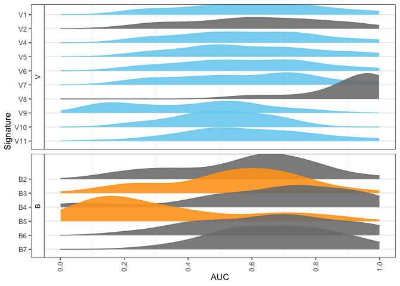
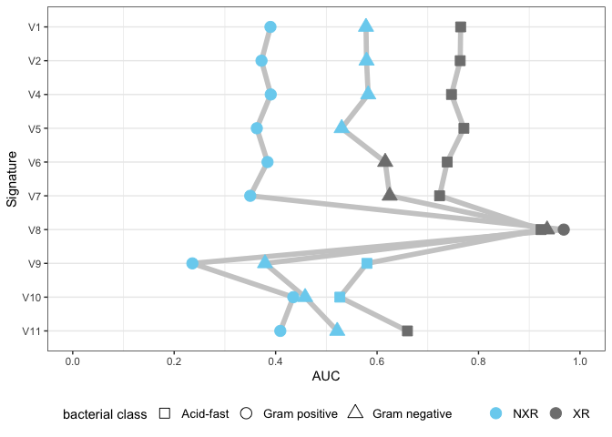
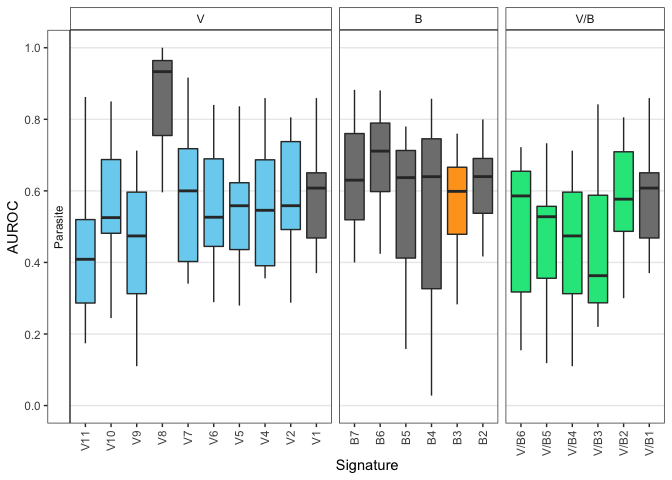
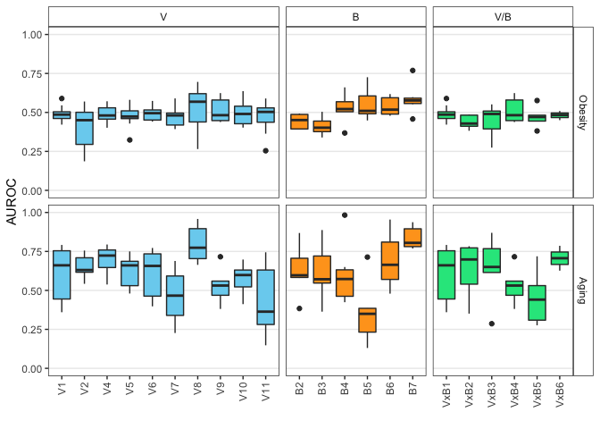

Figure 5: Nearly all infection signatures are cross-reactive with unin-
tended infections or non-infectious conditions

Figure 5A & C cross-reactivity of viral and bacterial signatures
----------------------------------------------------------------

Cross-reactivity is evaluated using
`analysis/calc_robustness_crossreactivity.R`

    library(ggplot2)
    library(dplyr)

    ## 
    ## Attaching package: 'dplyr'

    ## The following objects are masked from 'package:stats':
    ## 
    ##     filter, lag

    ## The following objects are masked from 'package:base':
    ## 
    ##     intersect, setdiff, setequal, union

    library(openxlsx)
    library(ggthemes)
    library(stringr)
    library(scales)
    library(ggh4x)
    library(ggpubr)
    library(ggradar)
    library(ggridges)
    library(grid)

    source('../analysis/helperFunctions.R')

    ## Loading required package: AnnotationDbi

    ## Warning: package 'AnnotationDbi' was built under R version 4.0.3

    ## Loading required package: stats4

    ## Loading required package: BiocGenerics

    ## Warning: package 'BiocGenerics' was built under R version 4.0.5

    ## Loading required package: parallel

    ## 
    ## Attaching package: 'BiocGenerics'

    ## The following objects are masked from 'package:parallel':
    ## 
    ##     clusterApply, clusterApplyLB, clusterCall, clusterEvalQ,
    ##     clusterExport, clusterMap, parApply, parCapply, parLapply,
    ##     parLapplyLB, parRapply, parSapply, parSapplyLB

    ## The following objects are masked from 'package:dplyr':
    ## 
    ##     combine, intersect, setdiff, union

    ## The following objects are masked from 'package:stats':
    ## 
    ##     IQR, mad, sd, var, xtabs

    ## The following objects are masked from 'package:base':
    ## 
    ##     anyDuplicated, append, as.data.frame, basename, cbind, colnames,
    ##     dirname, do.call, duplicated, eval, evalq, Filter, Find, get, grep,
    ##     grepl, intersect, is.unsorted, lapply, Map, mapply, match, mget,
    ##     order, paste, pmax, pmax.int, pmin, pmin.int, Position, rank,
    ##     rbind, Reduce, rownames, sapply, setdiff, sort, table, tapply,
    ##     union, unique, unsplit, which.max, which.min

    ## Loading required package: Biobase

    ## Warning: package 'Biobase' was built under R version 4.0.3

    ## Welcome to Bioconductor
    ## 
    ##     Vignettes contain introductory material; view with
    ##     'browseVignettes()'. To cite Bioconductor, see
    ##     'citation("Biobase")', and for packages 'citation("pkgname")'.

    ## Loading required package: IRanges

    ## Warning: package 'IRanges' was built under R version 4.0.3

    ## Loading required package: S4Vectors

    ## Warning: package 'S4Vectors' was built under R version 4.0.3

    ## 
    ## Attaching package: 'S4Vectors'

    ## The following objects are masked from 'package:dplyr':
    ## 
    ##     first, rename

    ## The following object is masked from 'package:base':
    ## 
    ##     expand.grid

    ## 
    ## Attaching package: 'IRanges'

    ## The following objects are masked from 'package:dplyr':
    ## 
    ##     collapse, desc, slice

    ## 
    ## Attaching package: 'AnnotationDbi'

    ## The following object is masked from 'package:dplyr':
    ## 
    ##     select

    ## 

    ## Warning: package 'limma' was built under R version 4.0.3

    ## 
    ## Attaching package: 'limma'

    ## The following object is masked from 'package:BiocGenerics':
    ## 
    ##     plotMA

    ## Loading required package: lattice

    ## Loading required package: foreach

    ## Loading required package: iterators

    source('../analysis/plot_palette.R')

    # function to order data according to specificity stratified by input column
    getOrder <- function(input_data, col_name){
      col_name <- enquo(col_name)
      order <- input_data %>%
        group_by(!!col_name) %>%
        summarize('S' = sum(Specific.Logical)) %>%
        arrange(desc(S)) %>%
        pull(!!col_name)
      return(order)
    }

    # load signatures
    signatures_file <- '../tables/supp_1.xlsx'
    signatures <- read.xlsx(signatures_file)

    # load cross-reactivity calculations
    plot_file <- input_XR_file
    out <- readRDS(plot_file)

    plot_dat <- bind_rows(out) %>%
      filter(Type != 'Null') %>% # remove permuted labels
      mutate('Type' = factor(Type, levels = c('Discovery', 'Validation', 'New', 'Null'), ordered = T)) %>%
      mutate(Comparison = str_extract(pattern = 'VxB|V|B', string = Signature)) # identify signature comparison

    N_threshold = 5 # closed bound
    colors <- createColorScale()

    input_tmp_plot_dat <- plot_dat %>%
      filter(N >= N_threshold, Type != 'Null') %>%
      mutate(Signature = as.character(Signature))

    sig_order <- rev(c(paste0('V', 1:11), paste0('B', 1:7),  paste0('V/B', 1:7)))
    study_plot_dat <- input_tmp_plot_dat %>%
      mutate(Signature2 = factor(Signature, levels = sig_order, ordered = T)) %>%
      filter(!grepl(pattern = 'I', x = Signature)) 

    color_vals <- c("#79d2f0", "#ffa31f", "#1fe58c", "gray50")
    names(color_vals) <- c('V', 'B', 'V/B', 'non-specific') # swap bacterial and viral for this case 
    specificity_threshold = 0.6
    specificity_plot_dat <- study_plot_dat %>%
      filter(!Signature %in% c('B1', 'V3')) %>% 
      filter(!grepl(pattern = 'V/B', x = Signature)) %>%
      group_by(Signature) %>%
      mutate('med' = median(Scores)) %>% 
      mutate(Color = as.character(Comparison)) %>%
      mutate(Color = ifelse(med <= specificity_threshold, Color, 'non-specific')) %>% 
      mutate(Signature = factor(Signature, levels = sig_order, ordered = T)) %>%
      mutate(Comparison = factor(Comparison, levels = c('V', 'B'), ordered = T))

    p3 <- ggplot(specificity_plot_dat, aes(x = Scores, y = Signature, fill = Color, color = Color)) + 
      geom_density_ridges(quantile_lines = F, alpha = 0.9) + 
      #geom_vline(xintercept = specificity_threshold, linetype = 'dashed', color = 'blue') + 
      #geom_vline(xintercept = c(0.5), linetype = 'dashed', color = 'black') + 
      scale_fill_manual(values = color_vals) + 
      scale_color_manual(values = color_vals) + 
      labs(x = 'AUC') + 
      facet_grid(Comparison ~ ., scales = 'free', space = 'free', switch = 'y') +  
      #xlim(c(0,1)) + 
      theme_clean + 
      theme(legend.position = 'none', strip.background = element_rect(fill = 'white')) + 
      scale_x_continuous(breaks = seq(from = 0, to = 1, by = 0.2), limits = c(0,1)) +
      theme(axis.text.x = element_text(angle = 90, hjust = 1, vjust = 0.5))

    p3

    ## Picking joint bandwidth of 0.0764

    ## Picking joint bandwidth of 0.0827

5B — viral specificity by bacterial gram stain
----------------------------------------------

Gram stain information is available in `tables/bact_gram_stains.xlsx`

    # load gram stain information
    gram_stains <- read.xlsx('../tables/bact_gram_stains.xlsx') %>%
      mutate(Include = as.logical(Include)) %>%
      dplyr::select(Gram.stain, Study, Include, Age.Group, Tissue) %>%
      mutate(Gram.stain = gsub(pattern = 'acid-fast', replacement = 'Acid-fast', x = Gram.stain)) %>%
      mutate(Gram.stain = gsub(pattern = 'Pos', replacement = 'Gram positive', x = Gram.stain)) %>%
      mutate(Gram.stain = gsub(pattern = 'Neg', replacement = 'Gram negative', x = Gram.stain)) %>%
      mutate(Gram.stain = gsub(pattern = 'Mixed', replacement = 'Multiple gram types', x = Gram.stain)) %>%
      mutate(Gram.stain = gsub(pattern = 'not reported', replacement = 'Unreported', x = Gram.stain)) %>%
      mutate(Gram.stain = factor(Gram.stain, levels = c('Acid-fast', 'Gram positive', 'Multiple gram types', 'Gram negative', 'Unreported'), ordered = T))

    # gse77528 is parasitic
    # gse73464 is non-infectious
    accessions_to_remove <- c('GSE77528', 'GSE73464')
    plot_dat <- plot_dat %>%
      filter(!grepl(pattern = paste(accessions_to_remove, collapse = '|'), x = Study))

    input_tmp_plot_dat <- plot_dat %>%
      filter(N >= N_threshold, Type != 'Null', Comparison == 'V') %>%
      mutate(Signature = as.character(Signature))

    signature_labels <- unique(input_tmp_plot_dat$Signature)

    # join plotting data with gram stain information
    study_plot_dat <- input_tmp_plot_dat %>%
       mutate(Train_Label = ifelse(Type == 'Discovery', '○', '')) %>%
       left_join(gram_stains) %>%
       mutate('Signature' = factor(Signature, levels = signature_labels, ordered = T)) #%>%

    ## Joining, by = "Study"

       #mutate('Study' = factor(Study, levels = order_dat$Study), ordered = T)

    gram_plot_dat <- study_plot_dat %>%
      group_by(Gram.stain, Signature) %>%
        summarize(N = n(), AUC = median(Scores))

    ## `summarise()` has grouped output by 'Gram.stain'. You can override using the `.groups` argument.

    # plotting
    shape_vals <- c(22, 21, 24)
    names(shape_vals) <- c('Acid-fast', 'Gram positive', 'Gram negative')
    color_vals <- c('#79d2f0', 'gray50')
    names(color_vals) <- c('NXR', 'XR')
    p5c <- ggplot(gram_plot_dat %>%
                    filter(!Signature %in% c('V3')) %>% 
                    mutate(Signature = factor(Signature, levels = paste0('V', 11:1), ordered = T)) %>% 
                    filter(grepl(pattern = 'positive|negative|fast', x = Gram.stain)) %>%
                    mutate(XR = ifelse(AUC <= specificity_threshold, 'NXR', 'XR')), 
                  aes(x = Signature, y = AUC, shape = Gram.stain, group = Gram.stain, fill = XR, color = XR)) + 
      geom_line(size = 2, color = 'gray80') + 
      geom_point(size = 4) +
      scale_y_continuous(limits = c(0,1), breaks = seq(to = 1, from = 0, by = 0.2)) + 
      theme_clean + 
      scale_shape_manual(values = shape_vals, name = 'bacterial class') + 
      scale_fill_manual(values = color_vals, name = '') + 
      scale_color_manual(values = color_vals, name = '') + 
      theme(legend.position = 'top') + 
      coord_flip() + 
      guides(fill = 'none')

    p5c2 <- p5c + theme(legend.text = element_text(size = 10), legend.position = 'bottom')
    p5c2

5D-F: Cross-reactivity with parasitic infections, obesity, and aging
--------------------------------------------------------------------

Cross-reactivity is evaluated using
`analysis/calc_robustness_crossreactivity.R`

    parasite_df <- readRDS(parasite_cross_reactivity_file)
    sigs_to_omit <- c('V3', 'B1')

    specificity_threshold <- 0.6

    plot_dat_para <- parasite_df %>%
      dplyr::filter(Sig.Type != 'Influenza') %>%
      dplyr::filter(!Signature %in% sigs_to_omit) %>%
      mutate(Sig.Type = gsub(Sig.Type, pattern = 'x', replacement = '/')) %>%
      mutate(Sig.Type = gsub(Sig.Type, pattern = 'Virus', replacement = 'V')) %>%
      mutate(Sig.Type = gsub(Sig.Type, pattern = 'Bacteria', replacement = 'B')) %>%
      mutate(Sig.Type = factor(Sig.Type, levels = c('V', 'B', 'V/B'))) %>% 
      group_by(Signature) %>%
      mutate(med = median(Scores)) %>% 
      mutate(color = ifelse(med > specificity_threshold, 'not specific', as.character(Sig.Type))) %>%
      ungroup() %>%
      mutate(Signature = gsub(pattern = 'x', replacement = '/', x = Signature)) %>% 
      mutate(Signature = factor(Signature, levels = sig_order, ordered = T))

    color_vals <- c("#79d2f0", "#ffa31f", "#1fe58c", "gray50")
    names(color_vals) <- c('V', 'B', 'V/B', 'not specific')
    color_vals_para <- color_vals
    #color_vals_para[c('V', 'B', 'V/B')] <- c(rep('gold1', 3))
    f5b <- ggplot(plot_dat_para %>% mutate('Exposure' = 'Parasite'), 
           aes(x = Signature, y = Scores, fill = color)) + 
      geom_boxplot(outlier.shape = NA) +
      #geom_boxplot() +
      #geom_density_ridges() + 
      #geom_point(data = outlier_df, color = 'black', pch = 4) + 
      theme_clean + 
      #geom_point(data = df %>% 
      #             filter(grepl(pattern = 'GSE1124', x = Study), Sig.Type == 'VxB'), 
      #           aes(color = 'red')) + 
      #geom_line(aes(group = Study), alpha = 0.3) + 
       facet_grid(Exposure ~ Sig.Type, space = 'free', scales = 'free', switch = 'y') + 
      # theme(axis.text.x = element_text(angle = 45, hjust = 1)) + 
      scale_fill_manual(values = color_vals_para) + 
       #geom_hline(yintercept = c(0.6), linetype = 'dashed', color = 'blue') +
       #geom_hline(yintercept = 0.5, linetype = 'dashed', color = 'black') +
       #labs(x = 'AUROC') + 
      theme(strip.background = element_rect(fill = 'white')) + 
      scale_y_continuous(breaks = seq(from = 0, to = 1, by = 0.2), limits = c(0,1)) +
      theme(axis.text.x = element_text(angle = 90, hjust = 1, vjust = 0.5), legend.position = 'none') + 
      labs(y = 'AUROC')
    f5b  

    ## aging and obesity next
    # read results
    aging_obesity_results <- readRDS(aging_obesity_file) 

    # format for plotting
    plot_dat <- bind_rows(aging_obesity_results) %>%
      filter(!grepl(pattern = '^I', x = Signature))
    plot_dat[grepl(pattern = 'GSE65219', x = plot_dat$Study) & grepl(pattern = 'Sampson', x = plot_dat$Signature), 'Type'] <- 'Discovery'

    plot_dat <- plot_dat %>%
      mutate('Type' = factor(Type, levels = c('Discovery', 'Validation', 'New', 'Null'), ordered = T)) %>%
      mutate('Comparison' = str_extract(pattern = 'VxB|V|B', string = Signature))  %>%
      arrange(Comparison) %>%
      mutate(Signature = factor(Signature, levels = unique(Signature), ordered = T))

    # add exposure labels (aging or obesity)
    plot_dat <- plot_dat %>%
      left_join(exposure_df)

    ## Joining, by = "Study"

    N_threshold = 0
    #colors <- createColorScale()

    # facet by pathogen and cluster rows/columns
    plot_list <- list()
    head(plot_dat)

    ##               Study Accession Platform  N N_neg N_pos  pos_genes neg_genes
    ## 1  GSE63117_GPL7020  GSE63117  GPL7020 18    20    18 4627 64411          
    ## 2 GSE65219_GPL15988  GSE65219 GPL15988 30    30   146 4627 64411          
    ## 3  GSE110551_GPL570 GSE110551   GPL570 78    78    78 4627 64411          
    ## 4   GSE18897_GPL570  GSE18897   GPL570 20    20    60 4627 64411          
    ## 5  GSE41233_GPL6947  GSE41233  GPL6947 11    11    21 4627 64411          
    ## 6 GSE53232_GPL11532  GSE53232 GPL11532 60    68    60 4627 64411          
    ##   frac_pos frac_neg Type Signature    Scores P.Value Comparison Exposure
    ## 1      1.0       NA  New        B1 0.6666667   0.033          B    Aging
    ## 2      1.0       NA  New        B1 0.6897260   0.000          B    Aging
    ## 3      0.5       NA  New        B1 0.3972715   0.992          B  Obesity
    ## 4      0.5       NA  New        B1 0.2308333   0.999          B  Obesity
    ## 5      0.5       NA  New        B1 0.5584416   0.311          B  Obesity
    ## 6      1.0       NA  New        B1 0.5830882   0.053          B  Obesity

    table(plot_dat$Exposure.Class)

    ## < table of extent 0 >

    exposures <- unique(plot_dat$Comparison)

    pattern_vals <- c('none', 'stripe')
    names(pattern_vals) <- c('Aging', 'Obesity')
    f5efg_list <- list()
    plot_dat <- plot_dat %>% 
      mutate(Comparison = gsub(pattern = 'VxB', replacement = 'V/B', x = Comparison)) %>%
      mutate(Comparison = factor(Comparison, levels = c('V', 'B', 'V/B'), ordered = T))

    #color_vals_noninf <- color_vals_para[2:4]
    #names(color_vals_noninf) <- c('Aging', 'Obesity', 'not specific')
    f5efg <- ggplot(plot_dat %>%
                      filter(!Signature %in% sigs_to_omit) %>%
                      filter(!is.na(Comparison)) %>% 
                      #filter(Exposure == 'Aging') %>% 
                      mutate(Exposure = factor(Exposure, levels = c('Obesity', 'Aging'), ordered = T)) %>% 
                      group_by(Exposure, Signature) %>%
                      mutate('med' = median(Scores)) %>% 
                      mutate('specific' = ifelse(med <= specificity_threshold, as.character(Exposure), 'not specific')),
                    aes(x = Signature, y = Scores, fill = Comparison)) + 
      geom_boxplot() + 
      #scale_pattern_manual(values = pattern_vals) + 
      facet_grid(Exposure ~ Comparison, scales = 'free', space = 'free') +
      #facet_grid(. ~ Comparison, scales = 'free', space = 'free') +
      #ylim(c(0,1)) + 
      scale_fill_manual(values = color_vals) +
      #geom_hline(yintercept = c(0.6), color = 'blue', linetype = 'dashed') +
      #geom_hline(yintercept = c(0.5), color = 'black', linetype = 'dashed') + 
      theme_clean + 
      theme(axis.text.x = element_text(angle = 90, hjust = 1, vjust = 0.5)) + 
      labs(x = '', y = 'AUROC') + 
      theme(legend.position = 'none', strip.background = element_rect(fill = 'white')) + 
      ylim(c(0,1))
    f5efg

